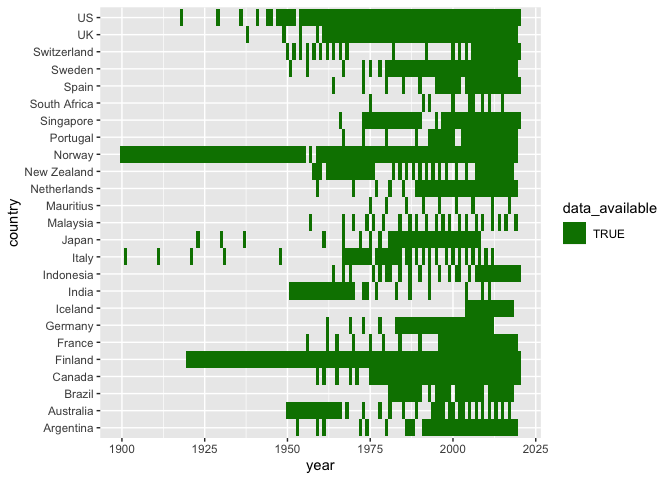
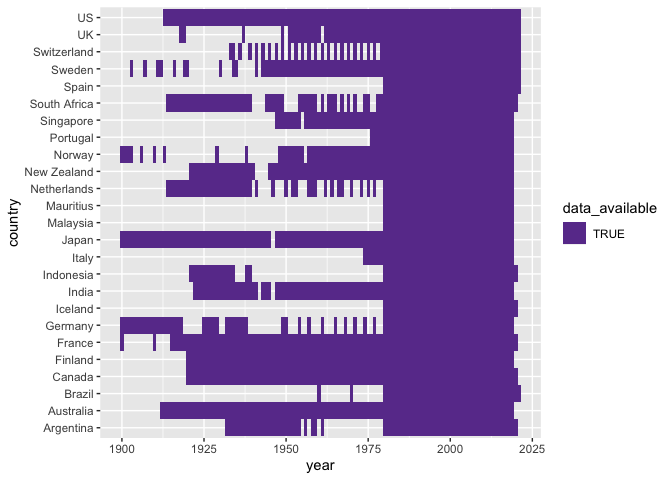
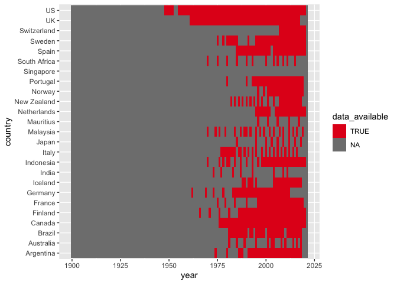
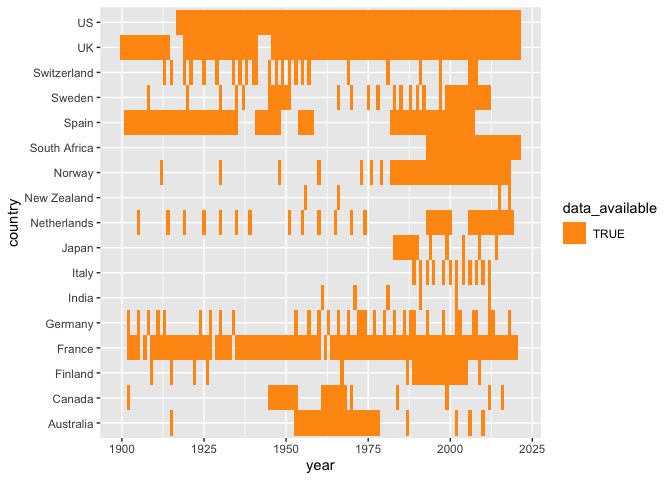
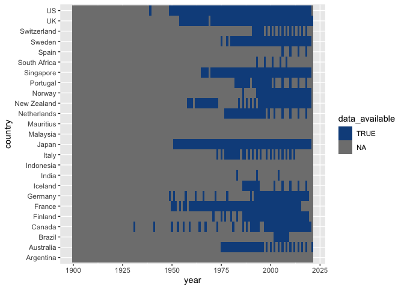

# Chartbook of Economic Inequality

The data and metadata for each country are hosted on public Google Sheets documents, which can be accessed [here](https://docs.google.com/spreadsheets/d/1jLNfP3iuteUJrH0zS9qWONskyKh9pFcl1hKSlgEc-I8/edit#gid=1578718062).


### Instructions on how to create charts and webpages

Clone the repository into current working directory

```
git clone https://github.com/owid/chartbook.git
```

Create a virtual environment and activate

```
python3 -m venv venv
source venv/bin/activate
```

Install necessary packages

```
pip install -r requirements.txt
```

Sync the data in the repo with the data currently in the spreadsheet:

```
import pandas as pd

url = "https://docs.google.com/spreadsheets/d/1jLNfP3iuteUJrH0zS9qWONskyKh9pFcl1hKSlgEc-I8/gviz/tq?tqx=out:csv&sheet=All+data"
all_data = pd.read_csv(url)
all_data.to_csv('raw_df.csv')
```

Populate the final chart datasets for each country (writes final series data to bottom_chart.csv, and top_chart.csv where relevant)

```sh
cd COUNTRY
Rscript dataprep.R
```

Populate the source chart datasets and edit chart.html for each country. 
 - Writes source series data into source_series_charts.js by copying the text of ../source_series_chart.js and inserting the data (string) after 'insert data'
 - Writes the final series description into in chart.html by copying the text of ../chart_no_ED.html - or ../chart_ED.html and inserting the final series description (div_string) after 'insert data'

```sh
cd COUNTRY
python chartprep.py
```

The data in source_series_charts.js should be formatted as such:

```sh
$scope.data[i] = [
        { 
            key: 'Chartbook series', type: 'line', values: 
                [
                    {'x': year, 'y': value, 'series': 0},
                    {'x': year, 'y': value, 'series': 0},
                    {'x': year, 'y': value, 'series': 0},
                    ...
                ], 
            yAxis: 1 
        }, 
        { 
            key: 'short reference - welfare concept', type: 'scatter', values: 
                [
                    {'x': year, 'y': value, 'series': 1}, 
                    {'x': year, 'y': value, 'series': 1},
                    {'x': year, 'y': value, 'series': 1},
                    ...
                ], 
            yAxis: 1
        },
        { 
            key: 'short reference - welfare concept', type: 'scatter', values: 
                [
                    {'x': year, 'y': value, 'series': j+1},
                    {'x': year, 'y': value, 'series': j+1},
                    {'x': year, 'y': value, 'series': j+1},
                    ...
                ],
            yAxis: 1
        }
        ...
    ];
```

To edit the height and width of chart elements, open chartbook.html within the country's folder and search for lines demarcated with '// XXX' 

Render HTML file in browser local port

```sh
python -m http.server
```

Open your browser and enter http://localhost:8000/

Update references (stored [here](https://github.com/owid/chartbook/blob/main/References.csv))

```sh
python read_references.py
```

### Index
|Country|Google sheet URL|
|-------|-----------------|
|Argentina|https://docs.google.com/spreadsheets/d/1Dc8tx6cTio_AugopaxWkcUNKcp_bMEkwZZRmaZ-LkvQ/edit?usp=sharing|
|Australia|https://docs.google.com/spreadsheets/d/1_WIBAjDLO7ufWuBFhRFr-GMl6dLgLz47-uF5EvC48ZY/edit?usp=sharing|
|Brazil|https://docs.google.com/spreadsheets/d/1IaA-lvbRlixYMLy5nW6xxJolaZyO4DK_0XvLQuLjJJs/edit?usp=sharing|
|Canada|https://docs.google.com/spreadsheets/d/1zxuxAXriOrp0x_dxklVbULKGqG3fEOGBkouUNWx7AY8/edit?usp=sharing|
|Finland|https://docs.google.com/spreadsheets/d/1ZakjK-hP6s4tLJZCEFjR7NVVqTkb6AXwgpvfpSwsT-I/edit?usp=sharing|
|France|https://docs.google.com/spreadsheets/d/1sySmwtRs_MvRrcVj52o9b0nG-bzbPMu1haIoSK8IWqk/edit?usp=sharing|
|Germany|https://docs.google.com/spreadsheets/d/1g8gGUHRye1L7hEu3HqYgM56RvjHrc3LD85kBwRZcYj4/edit?usp=sharing|
|Iceland|https://docs.google.com/spreadsheets/d/1YP9WzHiFVPZLLZ91_bMNa-EzrCy9ME_5nmDUZu7SN4A/edit?usp=sharing|
|India|https://docs.google.com/spreadsheets/d/1hyXWzYakYa8NKYHVIvEqjAvV9YeVti4gOxJkT4UqSlI/edit?usp=sharing|
|Indonesia|https://docs.google.com/spreadsheets/d/1A6HH3eHNo2ubWGe6XisQFINtnGcE9d1WmCCHRYGSe8M/edit?usp=sharing|
|Italy|https://docs.google.com/spreadsheets/d/1ovdfVn5BJymTzItKbZsvyt6qDjPoKsVLST23lms_1qc/edit#gid=1830755962|
|Japan|https://docs.google.com/spreadsheets/d/1pwS0793rjAZNcVHf4EbrpIGXBGo8C74oP7p0A9H3HXA/edit?usp=sharing|
|Malaysia|https://docs.google.com/spreadsheets/d/1DOyjueTHGkWQ8-0skJ5c5_tO8x6y4mbUCPp5nhRR30I/edit?usp=sharing|
|Mauritius|https://docs.google.com/spreadsheets/d/1_T_B9cGEGdKX6zNsh3cIUg_dzUlpoJ98oSPOKg7ga7Q/edit?usp=sharing|
|Netherlands|https://docs.google.com/spreadsheets/d/1L_0W3MMKbvcAIOiFGZTkQOcar7JUkzgVgbH0RnMAkag/edit?usp=sharing|
|New Zealand|https://docs.google.com/spreadsheets/d/1-ncVJ4sUG8j_5ThnN3_T9wzWdbo26pr1rYy5xDJF0f4/edit#gid=1830755962|
|Norway|https://docs.google.com/spreadsheets/d/1SNMeX0RWQE-rTkj3rAxK6uZQmQaqa2pr2QFP5wW2kb0/edit#gid=1830755962|
|Portugal|https://docs.google.com/spreadsheets/d/1EdqTg2eDWQZOcuKY-LCNkNwOcrgIFVpl3MxVNIjYhLU/edit?usp=sharing|
|Singapore|https://docs.google.com/spreadsheets/d/1tkNPvqgSfkPdyvRR8GPLkYOVkzNesPKyPFXTiWhT2H0/edit?usp=sharing|
|South Africa|https://docs.google.com/spreadsheets/d/1DG9yxRwQ2QcCOiUU0_u-YqGOtALMNvBboywp9t6tl0I/edit?usp=sharing|
|Spain|https://docs.google.com/spreadsheets/d/1xXFMMP4glUrPevj4-rW04mqKQj8ebPAiP2tKNx8l6QA/edit?usp=sharing|
|Sweden|https://docs.google.com/spreadsheets/d/1Ylee87yl-XL1PMeK9LMgLK5NkIxe5cmb7PdC53AoMWM/edit?usp=sharing|
|Switzerland|https://docs.google.com/spreadsheets/d/1NXeIVqzbCAUGE6KpGLURIDVKUxXK8qBWOWfuo9Wn1Os/edit?usp=sharing|
|UK|https://docs.google.com/spreadsheets/d/1qa1LD_R9F3hdnVcbo-MB6mAMoBOG-IcnSypQXzCeMj0/edit?usp=sharing|
|US|https://docs.google.com/spreadsheets/d/1ONdnOFLa-SxtMe3uxtv1J3hZY16Li9mBf9Oi2gE4YwI/edit?usp=sharing|

### Data availability
### Overall Income Inequality



### Top Income Shares



### Poverty



### Wealth Inequality



### Earnings Dispersion




