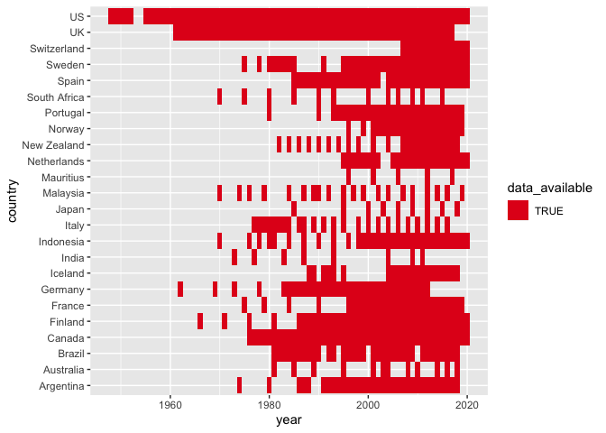
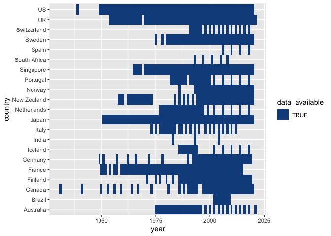

# Chartbook of Economic Inequality

The data and metadata for each country are hosted on public Google Sheets documents, which can be accessed [here](https://docs.google.com/spreadsheets/d/1jLNfP3iuteUJrH0zS9qWONskyKh9pFcl1hKSlgEc-I8/edit#gid=1578718062).

Instructions on how to set up a local server to see the charts (we assume that you have Python installed on your machine)

Clone the repository into current working directory

```
git clone https://github.com/owid/chartbook.git
```

Create a virtual environment and activate

```
python3 -m venv venv
source venv/bin/activate
```

Install necessary packages

```
pip install -r requirements.txt
```

Populate the chart datasets for each country (script does not work for Singapore)

```sh
cd COUNTRY
Rscript dataprep.R
```

To edit the height and width of chart elements, open chartbook.html within the country's folder and search for lines demarcated with '// XXX' 

Render HTML file in browser local port

```sh
python -m http.server
```

Open your browser and enter http://localhost:8000/

### Data availability

##### Overall Income Inequality


##### Top Income Shares


##### Poverty



##### Wealth Inequality


##### Earnings Dispersion


